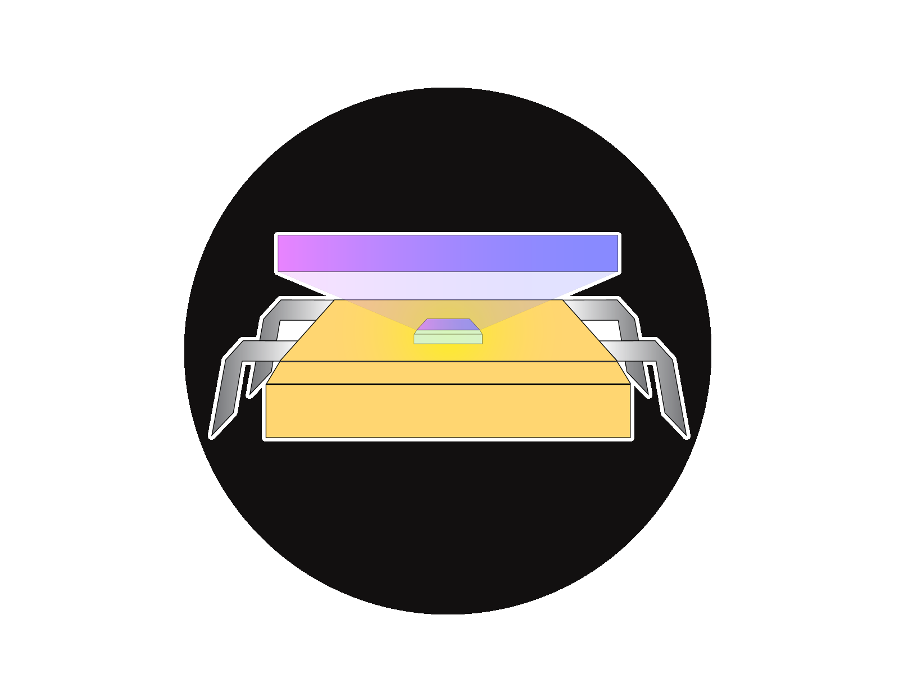

   

# ColorPixel 

## Darien Yeung (@Yeungdb)
University of Victoria, McIndoe Group

## Background

ColorPixel is a lightweight Python application for making colorbars from collecting single pixel from an input video. Leveraging imageio's capabilities for video frame extraction and obtaining the RGB values from the individual frame, the colors are stitched together via matplotlib to construct a colorbar plot. 

Developed for the original intent of monitoring the color change in a chemical reaction with a smart phone camera, ColorPixel is able to plot the color change over time as a colormetric chronograph (or colorbar).

## Quickstart
For Linux Users:

`pip install requirements.txt`

`python ColorPixel.py -i /path/to/inputfile -o /path/to/outputimage [FLAGS]

Options

`Options:
  -h, --help            show this help message and exit
  -f FRAMEN, --FrameN=FRAMEN
                        Generate frame N to look for pixel of interest
  -o OUTFILE, --outfile=OUTFILE
                        Filename of output file for Gradient Image
  -i FILENAME, --filename=FILENAME
                        Filename of file for processing
  -x XPIXEL, --xpixel=XPIXEL
                        Location of X pixel
  -y YPIXEL, --ypixel=YPIXEL
                        Location of Y pixel
  -n, --nyanFlag        Flag to set if use nyanbar
  -a, --nyanAudio       Flag to set if use nyanbar audio
  -t, --interactive     Interactive Pixel Picking
`
## Dependencies

 - Imageio
 - Matplotlib
 - optparse
 - nyanbar
 - mpldatacursor
 

## Contact

Twitter: https://twitter.com/Yeungdb

